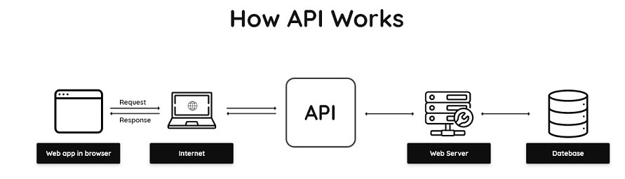

# What is an API?
* API- Application Programming Interface
* `APIs` are used to connect data across the world using a set of definitions and protocols
* `APIs` allow different types of software to communicate with one another, e.g. one website may need data from another website in order to function, and `APIs` facilitate this transfer of data.

## How does an API work?
Functionally, APIs take requests from users and format that into an acceptable form and send it to the target database. The `API` then receives data back from the database, and converts it into a widely available language (most commonly json) before sending it back to the user in a usable form.

* An `API` can be looked at as a set of rules on how 2 machines communicate
* The average flow looks like this: Client -> HTTP methods -> API -> HTTP request -> Server -> Your data -> API -> JSON -> Client
### 1) HTTP requests
A `HTTP` request is made by a client and sent to a named host which is located on a different server. The aim of the `HTTP` request is to get access to a resource on the server. Requests are made using components of a URL (Uniform Resource Locator) which has the information needed to access the resource.

