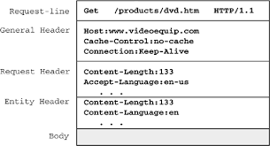
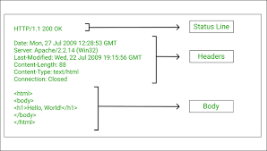

# What is an API?
* API- Application Programming Interface
* `APIs` are used to connect data across the world using a set of definitions and protocols
* `APIs` allow different types of software to communicate with one another, e.g. one website may need data from another website in order to function, and `APIs` facilitate this transfer of data.

## How does an API work?
Functionally, APIs take requests from users and format that into an acceptable form and send it to the target database. The `API` then receives data back from the database, and converts it into a widely available language (most commonly json) before sending it back to the user in a usable form.

* An `API` can be looked at as a set of rules on how 2 machines communicate
* The average flow looks like this: Client -> HTTP methods -> API -> HTTP request -> Server -> Your data -> API -> JSON -> Client
### HTTP requests
A `HTTP` request is made by a client and sent to a named host which is located on a different server. The aim of the `HTTP` request is to get access to a resource on the server. Requests are made using components of a URL (Uniform Resource Locator) which has the information needed to access the resource. `HTTP` requests have several elements :`a request line`, a series of `HTTP headers` and an optional `message body`.

1) `Request line`- The request line is the first line in the message, and it consists of 3 elements:
* A `method`: A one word command which tells the server what to do with the resource
* The path component of the URL for the request which identifies the resource on the server
* The HTTP version number which shows the HTTP specification to which the client has tried to make the message comply

`Request lines` can have additional information :
* A query string. This provides a string of information that the resource can use for some purpose. It follows the path, and is preceded by a question mark
* The `scheme` and `host components` of the URL, in addition to the path. When the resource location is specified in this way, it is known as the absolute **URI form**. This formatting is used when a request must pass through a `proxy server`. If the `host component` of the URL is not in the request line, it will be included in the `host header`

2) `HTTP headers`- These contain information in key:value pairs and inform the recipient about the message, the sender and the way in which the sender wants to communicate with the recipient. These can be divided into 3 categories:
* `General header`- An outdated term which communicates information about the message itself, but not what it carries. Contain general information and control how a message is processed and handled. They are now part of `request` or `response` headers due to being non-specific
* `Request header`- Contains information about the request, which allows the server to tailor the response. For example, it may state what language it wants the response in, or how many characters the response should be
* `Entity header/representration headers`- Describes how the message sent in the `HTTP message body` is represented, as the same data may be formatted in many ways depending on written language, geographical region and whether the message is compressed or encoded. `Representaion headerse` include information about: Content-Type, Content-Encoding, Content-Language, and Content-Location 

3) `Message body`- Usually left empty in `requets` because the client wants something from the server, and not to send excess information to the server.

### HTTP responses
This is the servers response to the clients request. The response aims to provide the client with the requested information, to inform the client that the request has been carried out or to inform the client of any errors which my have occurred. The response comprises : the `status line`, `HTTP headers` and `message body`

